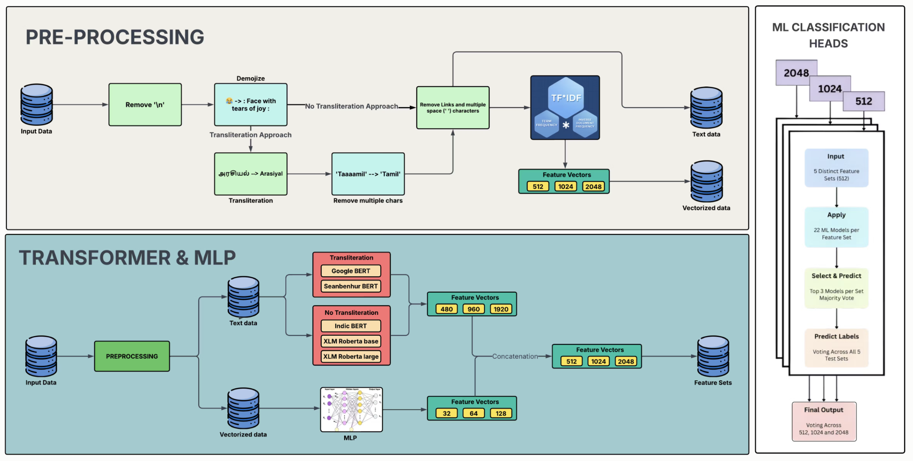

# Wise@LT-EDI 2025: Combining Classical and Neural Representations with Multi-scale Ensemble Learning for Code-mixed Hate Speech Detection

[](https://www.python.org/downloads/)
[](https://pytorch.org/)
[](https://huggingface.co/transformers/)
[](https://scikit-learn.org/)
[](https://www.python.org/downloads/)
[](https://pytorch.org/)
[](https://huggingface.co/transformers/)
[](https://scikit-learn.org/)
[](https://xgboost.readthedocs.io/)
[](https://lightgbm.readthedocs.io/)
[](https://catboost.ai/)
[](https://www.nltk.org/)
[](https://pandas.pydata.org/)
[](https://numpy.org/)
[](https://sites.google.com/view/lt-edi-2025)
[](https://github.com/Ganesh2609/VulnerableSpeechASR)
[](https://github.com/Ganesh2609/VulnerableSpeechASR)
[](https://github.com/Ganesh2609/VulnerableSpeechASR)

This repository contains the code implementation for our submission to the LT-EDI 2025 shared task on caste and migration-based hate speech detection in code-mixed Tamil social media content. Our approach achieved **3rd place** with an F1-score of **0.818**.

## Overview

Our multi-scale hybrid architecture combines classical TF-IDF features at multiple dimensions (512, 1024, and 2048) with contextual embeddings from five different transformer models. We employ a hierarchical ensemble strategy using majority voting across diverse feature sets, model architectures, and dimensionality scales.



## Contributors

1. **Ganesh Sundhar S**
2. **Durai Singh K**
3. **Gnanasabesan G**
4. **Hari Krishnan N**
5. **Dhanush MC**

**Affiliation**: Amrita School of Artificial Intelligence, Coimbatore, Amrita Vishwa Vidyapeetham, India

## Dataset

The dataset provided by the LT-EDI 2025 organizers contains:
- **Training set**: 5,512 comments
- **Development set**: 787 comments
- **Test set**: 1,576 comments
- **Total**: 7,875 comments

Labels:
- 0: Non-hate speech
- 1: Hate speech targeting caste/migration

## Methodology

### 1. Data Preprocessing

Two preprocessing approaches were implemented:

#### Without Transliteration:
- Replace newlines with spaces
- Convert emojis to text
- Remove URLs
- Normalize whitespaces
- Convert to lowercase

#### With Transliteration:
- All steps from above
- Transliterate Tamil Unicode to English equivalents
- Remove repeated characters in transliterated Tamil words
- Remove non-ASCII characters

### 2. Feature Extraction

#### TF-IDF Features:
- Extract features using optimized TF-IDF (grid search)
- Generate ~22,000 dimensional sparse vectors
- Apply Truncated SVD to reduce to 512, 1024, and 2048 dimensions
- Further compress using MLPs to 32, 64, and 128 dimensions

#### Transformer Embeddings:
Five pre-trained models were used:
1. **Google BERT** (bert-large-uncased)
2. **XLM-RoBERTa Base** 
3. **XLM-RoBERTa Large**
4. **Seanbenhur BERT** (tanglish-offensive-language-identification)
5. **IndicBERT** (IndicBERTv2-MLM-Back-TLM)

For models using transliterated input (Google BERT, Seanbenhur BERT):
- Process text with transliteration

For models using original text (IndicBERT, RoBERTa variants):
- Process text without transliteration

### 3. Multi-level Ensemble Architecture

1. **Feature Combination**: Concatenate TF-IDF and transformer embeddings
2. **ML Classifier Selection**: Train multiple classifiers per feature set:
   - Logistic Regression
   - Ridge Classifier
   - Support Vector Machines (Linear, RBF, Nu-SVM)
   - Random Forest
   - Extra Trees
   - Gradient Boosting
   - XGBoost
   - LightGBM
   - CatBoost
   - Neural Networks and others

3. **Hierarchical Ensemble**:
   - Level 1: Majority voting across top 3 classifiers per feature set
   - Level 2: Majority voting across 5 feature sets per dimension
   - Level 3: Final majority voting across all 3 dimensions

## Results

### Performance by Dimension and Model

#### Dimension: 512
| Transformer | Best Model | F1-Score |
|------------|------------|----------|
| Google BERT | Random Forest | 0.803 |
| IndicBERT | Random Forest | 0.817 |
| SeanBenhur BERT | XGBoost | 0.814 |
| XLM-R Base | Random Forest | 0.807 |
| XLM-R Large | Extra Trees | 0.806 |

#### Dimension: 1024
| Transformer | Best Model | F1-Score |
|------------|------------|----------|
| Google BERT | SVM | 0.818 |
| IndicBERT | Random Forest | 0.829 |
| SeanBenhur BERT | Random Forest | 0.822 |
| XLM-R Base | Nu-SVM | 0.825 |
| XLM-R Large | Random Forest | 0.830 |

#### Dimension: 2048
| Transformer | Best Model | F1-Score |
|------------|------------|----------|
| Google BERT | Gradient Boosting | 0.839 |
| IndicBERT | Ridge Regression | 0.824 |
| SeanBenhur BERT | Nu-SVM | 0.826 |
| XLM-R Base | Random Forest | 0.835 |
| XLM-R Large | Random Forest | 0.833 |

### Final Results

| Rank | Team Name | F1-Score |
|------|----------|----------|
| 1 | CUET_N317 | 0.88105 |
| 2 | CUET's_white_walkers | 0.86289 |
| **3** | **Wise** | **0.81827** |
| 4 | CUET_blitz_aces | 0.81682 |
| 5 | hinterwelt | 0.80916 |

## Training Performance Graphs

### Dimension: 512
**Google BERT**


**IndicBERT**


**Seanbenhur BERT**


**XLM-RoBERTa Base**


**XLM-RoBERTa Large**


### Dimension: 1024
**Google BERT**


**IndicBERT**


**Seanbenhur BERT**


**XLM-RoBERTa Base**


**XLM-RoBERTa Large**


### Dimension: 2048
**Google BERT**


**IndicBERT**


**Seanbenhur BERT**


**XLM-RoBERTa Base**


**XLM-RoBERTa Large**


## Repository Structure

```
Tamil-English-Code-Mixed-Text/
│
├── DL Feature set 512/
│   ├── Models/
│   │   ├── 📘 google_bert.py
│   │   ├── 📘 indic_model.py
│   │   ├── 📘 tanglish_model.py
│   │   ├── 📘 xlm_roberta_base.py
│   │   └── 📘 xlm_roberta_large.py
│   │
│   ├── No trans data/
│   │   ├── 📊 test_features_no_trans.csv
│   │   ├── 📊 test_processed_no_trans.csv
│   │   └── 📦 tfidf_vectorizer_2.pkl
│   │
│   ├── Original Data/
│   │   └── 📊 test.csv
│   │
│   ├── Processors/
│   │   ├── 📔 apply_vectorizer.ipynb
│   │   ├── 📔 no_transliteration_processor.ipynb
│   │   ├── 📔 tf_idf_vectorizer.ipynb
│   │   └── 📔 with_transliteration_processor.ipynb
│   │
│   ├── Train data/
│   │   └── Graphs/
│   │       ├── 📈 google_bert.png
│   │       ├── 📈 indic_bert.png
│   │       ├── 📈 seanbenhur_bert.png
│   │       ├── 📈 xlm_roberta_base.png
│   │       └── 📈 xlm_roberta_large.png
│   │
│   ├── Logs/
│   │   ├── 📄 google_bert.log
│   │   ├── 📄 indic_bert.log
│   │   ├── 📄 seanbenhur_bert.log
│   │   ├── 📄 xlm_roberta_base.log
│   │   └── 📄 xlm_roberta_large.log
│   │
│   ├── Results/
│   │   ├── google bert/
│   │   │   └── 📊 test_512_features
│   │   ├── indic bert/
│   │   │   └── 📊 test_512_features
│   │   ├── seanbenhur bert/
│   │   │   └── 📊 test_512_features
│   │   ├── xlm roberta base/
│   │   │   └── 📊 test_512_features
│   │   └── xlm roberta large/
│   │       └── 📊 test_512_features
│   │
│   └── Trainers/
│       ├── 📔 classification_features_generator.ipynb
│       ├── 📘 dataset.py
│       ├── 📘 logger.py
│       ├── 📘 trainer.py
│       └── 📘 training_bert.py
│
├── DL Feature set 1024/
│   └── [Same structure as DL Feature set 512]
│
├── DL Feature set 2048/
│   └── [Same structure as DL Feature set 512]
│
├── Trans data/
│   ├── 📊 test_features.csv
│   ├── 📊 test_processed.csv
│   └── 📦 tfidf_vectorizer_1.pkl
│
├── Images/
│   └── 📸 overview.png
│
├── ML Classification Heads/
│   ├── size 512/
│   │   ├── joblib_cache/
│   │   ├── catboost_info/
│   │   ├── google bert/
│   │   │   ├── 📊 predicted_test_2.csv
│   │   │   └── 📊 test_predictions.csv
│   │   ├── indic bert/
│   │   │   ├── 📊 predicted_test_2.csv
│   │   │   └── 📊 test_predictions.csv
│   │   ├── seanbenhur bert/
│   │   │   ├── 📊 predicted_test_2.csv
│   │   │   └── 📊 test_predictions.csv
│   │   ├── xlm roberta base/
│   │   │   ├── 📊 predicted_test_2.csv
│   │   │   └── 📊 test_predictions.csv
│   │   ├── xlm roberta large/
│   │   │   ├── 📊 predicted_test_2.csv
│   │   │   └── 📊 test_predictions.csv
│   │   ├── 📘 code.ipynb
│   │   ├── 📊 final_512.csv
│   │   ├── 📊 final_predictions.csv
│   │   ├── 📊 final_test.csv
│   │   └── 💡 1.test_performance.log
│   │
│   ├── size 1024/
│   │   └── [Same structure as size 512]
│   │
│   └── size 2048/
│       └── [Same structure as size 512]
│
├── Tamil-English-Transliterator/
│   └── [Transliterator module files]
│
└── 📖 README.md
```

## Dependencies

- Python 3.8+
- PyTorch 2.0+
- Transformers 4.0+
- scikit-learn 1.0+
- pandas
- numpy
- xgboost
- lightgbm
- catboost
- nltk
- emoji

## Key Findings

1. **Multi-scale representations improve performance**: Our ensemble across different dimensions (512, 1024, 2048) leverages different levels of feature granularity.

2. **Hybrid features are effective**: Combining traditional TF-IDF with modern transformer embeddings captures both statistical and contextual information.

3. **Model-specific preprocessing matters**: Using appropriate preprocessing (with/without transliteration) for different transformer models improves performance.

4. **Ensemble diversity is crucial**: The hierarchical ensemble across different feature sets, classifiers, and dimensions provides robustness.

## Limitations

1. Small dataset size (7,875 comments) may limit generalization
2. High computational complexity due to multi-level ensemble
3. Some training samples had inconsistent labeling
4. Limited to Tamil-English code-mixed content

## Acknowledgments

We thank the organizers of LT-EDI 2025 for providing the dataset and hosting this important shared task on hate speech detection in low-resource languages.